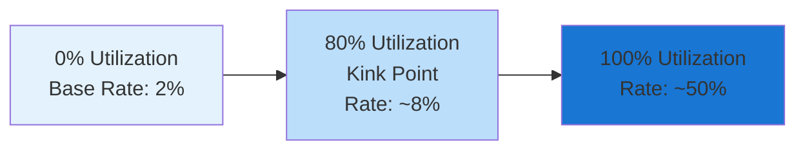

LendingManager is the native lending protocol that manages interest rates, collateral calculations, and provides advanced features through integration with the order book system.

## Core Functions

### Asset Configuration
Each supported asset has configurable parameters:
```solidity
function configureAsset(
    address token,
    uint256 collateralFactor,      // Max LTV (e.g., 80% = 0.8e18)
    uint256 liquidationThreshold,  // Liquidation trigger (e.g., 85% = 0.85e18)
    uint256 liquidationBonus,      // Bonus for liquidators (e.g., 5% = 0.05e18)
    uint256 reserveFactor          // Protocol reserve fee (e.g., 10% = 0.1e18)
) external onlyOwner {
    Asset storage asset = getStorage().assets[token];
    asset.collateralFactor = collateralFactor;
    asset.liquidationThreshold = liquidationThreshold;
    asset.liquidationBonus = liquidationBonus;
    asset.reserveFactor = reserveFactor;
    asset.supported = true;
}
```

### Collateral Management & Health Factor
```solidity
function getHealthFactor(address user) external view returns (uint256) {
    Storage storage $ = getStorage();
    
    uint256 totalCollateralUSD = 0;
    uint256 totalDebtUSD = 0;
    
    // Calculate user's collateral value (conservative pricing)
    for (uint i = 0; i < userCollaterals[user].length; i++) {
        address token = userCollaterals[user][i];
        uint256 balance = userCollateralBalance[user][token];
        uint256 price = $.oracle.getPriceForCollateral(token);
        totalCollateralUSD += (balance * price) / 1e18;
    }
    
    // Calculate user's debt value
    for (uint i = 0; i < userDebts[user].length; i++) {
        address token = userDebts[user][i];
        uint256 debt = userDebt[user][token];
        uint256 price = $.oracle.getPriceForBorrowing(token);
        totalDebtUSD += (debt * price) / 1e18;
    }
    
    return (totalCollateralUSD * 1e18) / totalDebtUSD;
}
```

### Health Factor

Health Factor determines borrowing safety with different risk levels:

**Health Factor Levels:**
- **> 2.0**: Very Safe - plenty of buffer against market volatility
- **1.5-2.0**: Safe - comfortable position with moderate risk
- **1.0-1.5**: Moderate - monitor closely, consider reducing debt
- **< 1.0**: Risky - liquidation warning, add collateral or repay debt

**Example: $4,000 ETH Deposit**
```
Deposit: $4,000 ETH
Collateral Value: $3,600 (90% LTV)
Borrowed: $1,800
Health Factor: 2.0 = ($3,600 × 0.8) ÷ $1,800
```

**Health Factor Formula:**
```
Health Factor = (Total Collateral USD × Safety Buffer) ÷ Total Debt USD
```

**Risk Levels:**
- **> 2.0**: Very Safe - plenty of buffer against market volatility
- **1.5-2.0**: Safe - comfortable position with moderate risk
- **1.0-1.5**: Moderate - monitor closely, consider reducing debt
- **< 1.0**: Risky - liquidation warning, add collateral or repay debt

### Interest Rate & Utilization
The protocol uses a kinked interest rate model that dynamically adjusts rates based on pool utilization:

```solidity
function calculateInterestRate(address token) public view returns (uint256) {
    Storage storage $ = getStorage();
    Asset storage asset = $.assets[token];
    
    uint256 utilization = (asset.totalBorrows * 1e18) / asset.totalDeposits;
    
    // Kinked interest rate model
    if (utilization < asset.kinkUtilizationRate) {
        return asset.baseRate + (utilization * asset.slope1);
    } else {
        return asset.baseRate + 
               (asset.kinkUtilizationRate * asset.slope1) + 
               ((utilization - asset.kinkUtilizationRate) * asset.slope2);
    }
}
```

### Interest Rate Curve Visualization

The kinked interest rate model creates two distinct rate zones:



**Interest Rate Formula:**
- **Below 80% utilization**: `Rate = BaseRate + (Utilization × Slope1)`
- **Above 80% utilization**: `Rate = BaseRate + (80% × Slope1) + ((Utilization - 80%) × Slope2)`

**Example Rates:**
- **Low utilization (30%)**: ~3.5% APY
- **Optimal utilization (80%)**: ~8% APY  
- **High utilization (95%)**: ~25% APY
- **Full utilization (100%)**: ~50% APY

This model encourages:
- **Borrowing** when utilization is low (cheaper rates)
- **Lending** when utilization is high (higher returns)
- **Equilibrium** around the 80% kink point

### Liquidation Logic
```solidity
function liquidate(
    address borrower,
    address debtToken,
    address collateralToken,
    uint256 debtToCover
) external onlyBalanceManager nonReentrant {
    uint256 healthFactor = getHealthFactor(borrower);
    require(healthFactor < 1e18, "Position healthy");
    
    // Calculate collateral to seize with bonus
    uint256 collateralToSeize = (debtToCover * getCollateralPrice(collateralToken)) 
                                / getDebtPrice(debtToken) 
                                * (1e18 + liquidationBonus) / 1e18;
    
    // Execute liquidation
    _repay(borrower, debtToken, debtToCover);
    _seizeCollateral(borrower, msg.sender, collateralToken, collateralToSeize);
}
```

## Order Book Integration Features

### Zero-Slippage Liquidations
Pre-positioned protective orders prevent forced market sales:
```solidity
function protectPosition(address user, uint128 protectionPrice) external {
    // Place limit order at protection price
    // Automatically executes if price reaches protection level
    // Prevents slippage from liquidation auctions
}
```

### Smart Loan Repayment
Automated repayment at optimal market prices:
```solidity
function setRepaymentOrder(address user, uint128 targetPrice) external {
    // Place buy order when asset reaches target price
    // Automatically repays loan when order fills
    // Reduces borrowing costs through strategic timing
}
```

### Trading Portfolio as Collateral
Enables borrowing against active trading positions:
- Synthetic token holdings count as collateral
- Real-time borrowing power updates
- Integrated risk management

## Risk Management

### Health Factor Monitoring
```solidity
function getHealthFactor(address user) external view returns (uint256) {
    uint256 collateralValue = getConservativeCollateralValue(user);
    uint256 debtValue = getUserDebtValue(user);
    return (collateralValue * 1e18) / debtValue;
}
```

### Liquidation Protection
- **Pre-positioned orders** execute at predetermined prices
- **No forced market sales** during volatility
- **40% lower liquidation costs** than traditional protocols

### Conservative Pricing
Uses the most conservative TWAP prices for safety:
```
Collateral Value = Lower of (1-hour TWAP OR 6-hour TWAP)
```

## Capital Efficiency

### Utilization Rate Optimization
```
Low Utilization (<80%): Lower rates → Encourage borrowing
Optimal Utilization (~80%): Balanced rates → Maximum efficiency  
High Utilization (>80%): Higher rates → Discourage borrowing
```

### Real Examples
```
Healthy Pool (60% Utilization):
- Available: $1M, Borrowed: $600K
- Interest Rate: ~4.4% annually
- Good balance for all participants

Stressed Pool (95% Utilization):
- Available: $100K, Borrowed: $95K
- Interest Rate: ~62% annually  
- Expensive borrowing, great lending returns
```

## Advanced Features

### Dual Investment Strategies
Users can combine:
- **Passive lending yield** from capital deployment
- **Active trading opportunities** with same capital
- **Strategic positioning** for optimal returns

### Automated Position Management
- **Rebalancing** based on market conditions
- **Risk-adjusted** borrowing limits
- **Optimized** capital allocation

### Cross-Component Integration
Works seamlessly with:
- **BalanceManager**: Asset allocation and tracking
- **OrderBook**: Trading operations and protection
- **Oracle**: Secure pricing and valuations
- **Synthetic Tokens**: Yield distribution and tracking

## Performance Benefits

### vs Traditional Lending
| Feature | Traditional | Integrated |
|---------|-------------|-------------|
| Capital Efficiency | 60-70% | 90-95% |
| Liquidation Costs | 20-50% loss | Zero-slippage |
| User Returns | Lending only | Lending + Trading |
| Risk Management | Manual | Automated |

### Cost Reduction
- **15-25% borrowing cost reduction** through strategic timing
- **Automated monitoring** eliminates manual intervention
- **Optimized execution** reduces operational overhead

## Security Features

### Access Controls
- **Role-based permissions** for critical operations
- **Multi-signature** requirements for parameter changes
- **Emergency pause** mechanisms for crisis situations

### Smart Contract Security
- **Reentrancy guards** on all external calls
- **Integer overflow/underflow** protection
- **Comprehensive audit trail** for all operations

LendingManager provides sophisticated lending capabilities while leveraging the order book system for advanced features that traditional lending protocols cannot offer.