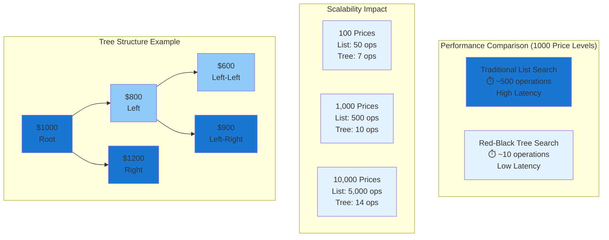

The OrderBook engine is a high-performance Central Limit Order Book (CLOB) that uses Red-Black Tree data structures for optimal price operations and supports synthetic token trading.

## Core Architecture

### Red-Black Tree Implementation
The OrderBook uses `RedBlackTreeLib` for efficient price organization:
```solidity
import {RedBlackTreeLib} from "@solady/utils/RedBlackTreeLib.sol";

contract OrderBook {
    using RedBlackTreeLib for RedBlackTreeLib.Tree;
    
    // Price trees for each side
    RedBlackTreeLib.Tree private bidTree;
    RedBlackTreeLib.Tree private askTree;
}
```

### Performance Visualization
The Red-Black Tree provides dramatic performance improvements over traditional list-based order books:



### Performance Benefits
- **O(log n)** price searches vs O(n) traditional lists
- **350x faster** for 10,000 price levels (14 vs 5,000 operations)
- Automatic tree rebalancing on order updates
- Instant best bid/ask price discovery
- **Sub-millisecond** execution for high-frequency trading

### Order Structure
```solidity
struct Order {
    uint128 price;
    uint128 quantity;
    uint128 filled;
    Side side;
    OrderType orderType;
    TimeInForce timeInForce;
    uint48 id;
    uint48 expiry;
    address user;
    Status status;
}
```

### Trading Rules Validation
```solidity
function validateOrder(
    uint128 price,
    uint128 quantity,
    Side side,
    OrderType orderType,
    TimeInForce timeInForce
) private view {
    // Check minimum order sizes
    validateMinimumSizes(orderAmount, quoteAmount);
    
    // Check price increments
    uint256 minPriceMove = $.tradingRules.minPriceMovement;
    if (price % minPriceMove != 0) {
        revert InvalidPriceIncrement();
    }
    
    // Check order expiration
    if (orderType != OrderType.MARKET && 
        block.timestamp > expiry) {
        revert OrderExpired();
    }
}
```

## Order Management

### Order Structure
```solidity
struct Order {
    address user;         // Order creator
    uint128 price;        // Order price
    uint128 quantity;     // Order quantity
    uint128 filled;       // Amount filled
    Side side;            // Buy or sell
    OrderType orderType;  // Limit, market, etc.
    uint48 expiry;        // Order expiration
    Status status;        // Active, filled, cancelled
}
```

### Price Level Queues
At each price level, orders are managed in FIFO queues:
- **First-in-first-out** execution at same price
- **O(1)** operations for queue management
- Efficient order matching algorithms

## Synthetic Token Trading

### Trading Mechanics
- Synthetic tokens trade while earning yield
- 1:1 value pegging ensures clean price discovery
- No yield interference with order book operations

### Order Types Supported
- **Limit Orders**: Traditional limit order placement
- **Market Orders**: Immediate execution at best prices
- **Post-Only**: Maker-only orders (reject if would cross spread)
- **Iceberg Orders**: Large orders broken into smaller pieces

### Liquidity Enhancement
Orders provide dual benefits:
- **Trading Functionality**: Standard order book operations
- **Yield Generation**: Idle order capital earns lending yield

## Order Matching Engine

### Matching Algorithm
```solidity
function matchOrders(Side side, uint128 price, uint128 quantity) external {
    // 1. Find opposing orders at or better than input price
    // 2. Execute FIFO matching at each price level
    // 3. Update order statuses and balances
    // 4. Notify BalanceManager of token transfers
    // 5. Trigger yield updates on balance changes
}
```

### Price Improvement
- Orders may receive better prices through price-time priority
- Multiple price levels can be consumed in single execution
- Slippage protection through limit order mechanisms

## Integration with Protocol

### BalanceManager Integration
- Locks synthetic tokens during order placement
- Updates balances on order execution/cancellation
- Coordinates yield tracking on balance changes

### Oracle Integration
- Receives price feeds for fair market pricing
- Validates prices against manipulation
- Provides reference rates for settlements

### LendingManager Integration
- Enables borrowing against trading positions
- Supports pre-positioned protective orders
- Facilitates automated loan repayments

## Advanced Features

### High-Frequency Trading Support
- Sub-millisecond order processing
- Batch order operations
- Efficient state updates

### Risk Management
- Position size limits per user
- Automatic order expiration
- Circuit breaker mechanisms

### Gas Optimization
- Packed order structures for storage efficiency
- Bulk operations for multiple updates
- Lazy state updates where possible

## Security Features

### Order Validation
- Sufficient balance checks before placement
- Price range validations
- Expiration time enforcement

### Access Control
- Only authorized contracts can modify orders
- Rate limiting for order operations
- Emergency pause functionality

The OrderBook engine provides institutional-grade trading performance while seamlessly integrating with the protocol's lending and yield generation systems.