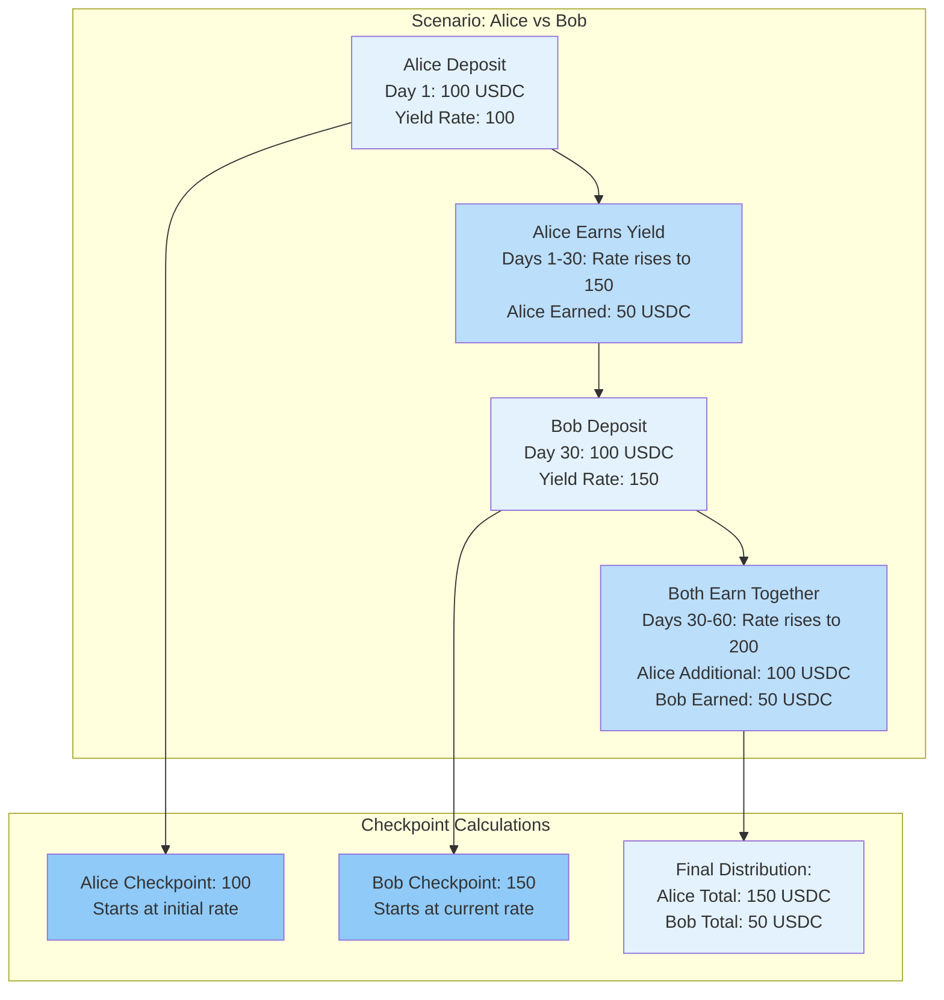

Synthetic tokens are ERC20 tokens that represent 1:1 pegged underlying assets while enabling separate yield tracking through a weighted checkpoint mechanism.

## Token Properties

### 1:1 Pegging
Each synthetic token always maintains a 1:1 relationship with its underlying asset:
- 1 sUSDC = 1 USDC (stable value)
- 1 sETH = 1 ETH (stable value)
- No appreciation or depreciation of token value

### Yield-Bearing Capability
While maintaining stable value, synthetic tokens:
- Accrue yield from lending operations continuously
- Track yield separately from token balance
- Enable claimable yield at any time

### Order Book Compatibility
Designed specifically for CLOB trading:
- Predictable order sizes (100 sUSDC = exactly 100 USDC value)
- Clean price discovery (no yield interference)
- Standard trading mechanics

## Weighted Checkpoint System

### Global Yield Counter
Tracks total yield generated per underlying asset:
```solidity
mapping(address => uint256) public yieldPerToken;
```

### User Checkpoints
Each user has individual checkpoints for fair yield tracking:
```solidity
mapping(address => mapping(address => uint256)) public userYieldCheckpoints;
```

### Yield Calculation Formula
```
User Yield = Token Balance × (Current Yield Per Token - User Checkpoint) ÷ PRECISION
```

## Checkpoint Updates

### On Deposits
```
New Checkpoint = (Old Balance × Old Checkpoint + New Deposit × Current Yield Rate) ÷ (Old Balance + New Deposit)
```

### On Withdrawals
```
New Checkpoint = (Old Balance × Old Checkpoint - Withdrawal × Current Yield Rate) ÷ (Old Balance - Withdrawal)
```

### Weighted Checkpoint Visualization

The weighted checkpoint mechanism ensures fair yield distribution for users joining at different times:



**Fair Distribution Example:**
```
Alice: 100 USDC for 60 days → 150 USDC yield (50% return)
Bob: 100 USDC for 30 days → 50 USDC yield (50% return)

Both earn the same rate (50%) proportional to their participation time!
```

**Benefits of Weighted Checkpoints:**
- **Fairness**: Users earn based on actual participation time
- **Efficiency**: Single global update serves all users
- **Accuracy**: Weighted averages prevent gaming the system
- **Transparency**: Clear mathematical formula for yield calculation

### On Trading
Checkpoint updates maintain fair yield tracking during active trading through weighted averages.

## Technical Implementation

### ERC20 Integration
```solidity
contract SyntheticToken is ERC20 {
    function mint(address to, uint256 amount) external {
        _mint(to, amount);
        updateYieldCheckpoint(to);
    }
    
    function transfer(address to, uint256 amount) public override returns (bool) {
        _transfer(_msgSender(), to, amount);
        updateYieldOnTransfer(_msgSender(), to, amount);
        return true;
    }
}
```

### Yield Tracking
- Yield calculation occurs O(1) per user
- Global updates scale to unlimited users
- No individual account updates needed

## Benefits Over Traditional Models

### vs aTokens (Aave-style)
| Feature | aTokens | Synthetic Tokens |
|---------|---------|------------------|
| Value Stability | Changes with yield | Always 1:1 stable |
| Order Trading | Complex (changing value) | Simple (stable value) |
| Price Discovery | Corrupted by yield | Pure market dynamics |
| Slippage Calculation | Imprecise | Accurate |

### System Advantages
- **Order Book Isolation**: Trading operations unaffected by yield calculations
- **Capital Efficiency**: Tokens trade freely while earning yield
- **User Experience**: Simple 1:1 understanding, no complexity
- **Gas Optimization**: Efficient yield tracking at scale

## Integration with Protocol

### BalanceManager Interaction
- Mints tokens on user deposits
- Tracks user checkpoints
- Coordinates yield distributions

### OrderBook Integration
- Locks tokens during active orders
- Updates balances on trades
- Maintains trading functionality

### LendingManager Integration
- Receives yield distributions
- Updates global counters
- Calculates user entitlements

Synthetic tokens enable the unified protocol's core innovation: maintaining clean order book operations while generating yield on all capital states.