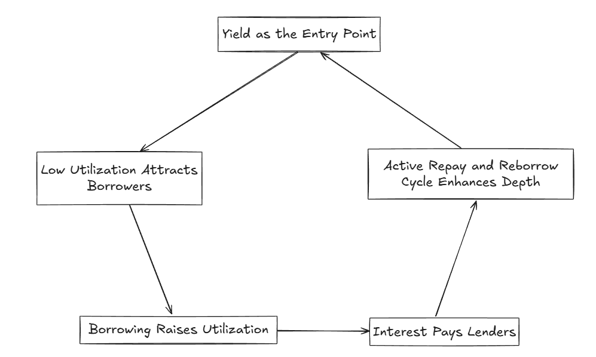

# Welcome to ScaleX Protocol 
# "A Revolutionary Yield-Bearing CLOB"

ScaleX Protocol is **a revolutionary CLOB that automatically generates yield on idle limit orders**. Users can earn yield while executing trading strategies with customized prices - no more choosing between trading opportunities and passive income.  

We enable yield gains to users trading activity. No matter in a losing or winning position without expiry date

## Lending Protocol Instead of Conventional Staking

Unlike traditional staking, where assets are locked and idle, lending protocols keep assets productive and liquid.  

Lenders can earn yield while maintaining access to capital, allowing them to reuse or withdraw anytime without waiting for an unstaking period.  

At the same time, borrowers can customize leverage, position sizing, and strategy, optimizing cost and capital efficiency.  

This creates a both-sided advantage, lenders **maximize utilization** of idle funds, while borrowers **reduce transaction friction** by sourcing liquidity directly from the protocol instead of hopping between pools.

---
## Why CLOB DEX and Lending Protocol are a perfect duo

Central Limit Order Book (CLOB) DEXes match limit orders. While orders wait in the book, they **do not earn yield**.  
Lending protocols continuously generate interest based on utilization. When combined, **idle capital can earn yield** until an order is filled, and borrowing demand increases utilization, reinforcing the **flywheel**.

Here is the flow at a glance:

**Yield Opportunity Attracts Deposits**

Traders are drawn to the platform by its yield-bearing mechanism, depositing assets into the pool even before orders are filled

**Low Utilization Attracts Borrowers**

When utilization is low, borrowing is attractive, drawing in traders who want leverage and liquidity

**Borrowing Raises Utilization**

Borrow activity increases utilization of the lending pool, activating higher interest accrual

**Interest Pays Lenders**

Borrowers pay interest, which is distributed as yield to lenders whose capital powers the system

**Active Repay and Reborrow Cycle Enhances Depth**

Borrowers continuously execute repay and reborrow actions to maintain or increase positions, adding dynamic liquidity depth to the orderbook and stabilizing market flow.

So, CLOB-DEX are **perfect to continuously generate yield on idle capital while order to be filled**

---

## How ScaleX Solves Existing Limitations

While existing tools streamline certain aspects of trading and borrowing, they still leave users exposed to inefficiencies like forced borrowing, idle capital, or rigid repayment logic.  

**ScaleX** integrates these ideas into a single, yield-optimized system — merging liquidity, leverage, and automation into one composable DeFi architecture.

### 🚀 Comparison with Existing Solutions

| Feature | Existing Limitation | ScaleX Solution |
|---|---|---|
| Dual Investment Products | Fixed settlement price and expiry | **No expiry**, **continuous yield**, and **customizable target** for flexible management |
| Margin Loans | No automation and crypto support | **on-chain transparency**, **crypto assets supported**, and **programmable repayment** |
| Auto Borrow / Repay | Interest accrues instantly; fixed repayment logic | **Customizable borrow and repay parameters** — no forced size reduction, no idle interest |
| On-chain Yield Engines | Internal-only usage restrictions | **External asset compatibility** and **cross-protocol composability** |
