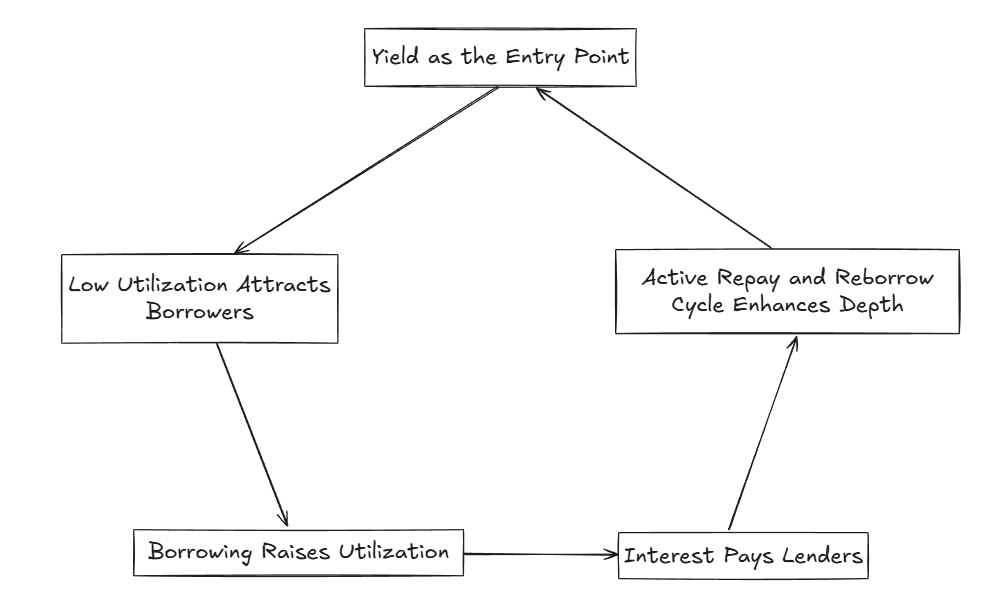

# Welcome to ScaleX Protocol
# "The Most Capital Efficient and Safe DApp for Agent and Human"

You've seen the problem. Capital sitting idle in orders. The ecosystem forcing you to choose between trading, betting, and earning. ScaleX solves this at the infrastructure level — every deposited dollar earns yield automatically, whether you're actively trading, placing a bet, or waiting for the right entry. For those who want to automate, ScaleX also provides an Agent layer that executes your strategy around the clock within rules you define.

---

## Architecture 1  The Agent

You don't have to watch the screen for your strategy to work — but the capital efficiency works the same whether you do or not.

ScaleX agents are built on **[ERC-8004](./architecture/erc8004)** on-chain identity. You authorize one, set your rules, and it handles the rest. It places your limit orders, manages borrow and repay cycles, protects your positions from liquidation, and monitors the market 24/7. No emotion. No fatigue. No missed entries.

You stay in control. The agent can only act within the policy you define. No private keys shared. No custody risk. If you want it to stop, you revoke authorization and it stops.

**What the agent does for you:**
- Places and manages limit orders at your target prices
- Borrows and repays automatically at optimal conditions
- Protects positions from liquidation using pre-set orders
- Builds an on-chain reputation you can verify before trusting it

---

## Architecture 2  The Yield-Bearing DEX

The core of ScaleX is a Yield-Bearing DEX — an engine that never lets your capital go idle. Whether you're using an agent or trading manually, every dollar earns automatically.

---

## Why CLOB DEX and Lending Protocol are a perfect duo

A CLOB DEX matches limit orders. While those orders sit in the book waiting to fill, **they earn nothing**. A lending protocol generates interest continuously based on utilization. Put them together and every order waiting in the book becomes capital that earns yield until it executes.

This is the engine the agent runs on. Every dollar it manages is either actively trading or quietly earning. There is no in-between.

Here is the flow at a glance:

1. **Yield Opportunity Attracts Deposits**  traders deposit assets drawn by yield, even before any orders fill
2. **Low Utilization Attracts Borrowers**  cheap borrowing rates pull in leveraged traders wanting liquidity
3. **Borrowing Raises Utilization**  borrow activity increases pool utilization, activating higher interest accrual
4. **Interest Pays Lenders**  borrower interest flows back as yield to the lenders whose capital powers the system
5. **Repay and Reborrow Cycle Deepens Liquidity**  continuous repay and reborrow actions add dynamic depth to the orderbook and stabilize market flow

Every user — human or agent — contributes to and benefits from this flywheel.

---

## How ScaleX Solves Existing Limitations

Every tool before ScaleX solved part of the problem. Order book DEXes gave execution but left capital idle. Lending protocols gave yield but locked capital out of trading. Copy trading and bots automated actions but had no safety, no yield, and no accountability. None of them made capital work at maximum efficiency.

ScaleX combines the Yield-Bearing DEX and the Agent into one system — where capital never stops working and you never have to choose between trading, betting, and earning.

###  Comparison with Existing Solutions

| Product | Why It Fell Short | ScaleX Solution |
|---|---|---|
| Common LLM / ERC-8004 | Unpredictable execution, high token cost, no yield, hard to audit | **Policy-bound agent** with on-chain identity, verifiable reputation, and capital earning yield between actions |
| Binance / Bybit Copy Trading | Copies human flaws, not agent-compatible, idle capital while waiting | **Automated agent** with no emotion or fatigue, earning yield on capital at all times |
| Pump.fun Sniper Bot | Scam-heavy, no safety, no yield, race-to-bottom against other bots | **Strategy-driven agent** with risk limits, transparent execution, and continuous yield |
| Conway Research Web4 | Developer-only setup, no yield mechanism, agents consume without earning | **Accessible agent** anyone can authorize, running on a yield-bearing DEX that keeps capital productive |
